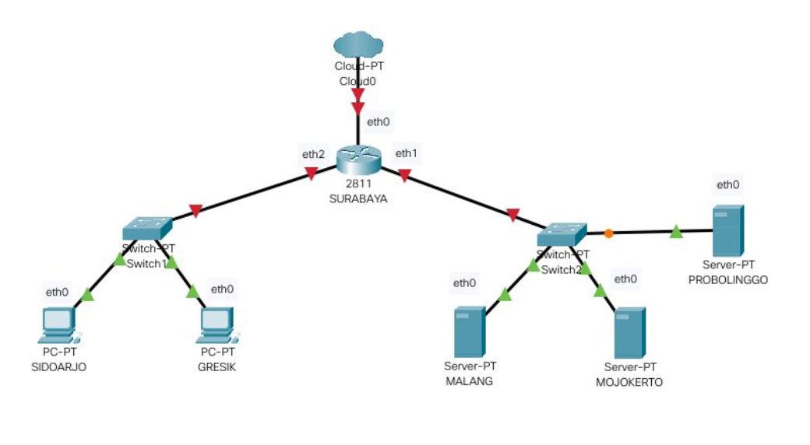

# **Jarkom_Modul2_Lapres_B14**
### Anggota Kelompok:
- IQBAAL PRATAMA PUTRA  (05111840000021)
- DWI WAHYU SANTOSO     (05111840000121)

## Topologi:
- SURABAYA    : Router
- MALANG      : DNS Server Master
- MOJOKERTO   : DNS Server Slave
- PROBOLINGGO : Web Server
- GRESIK      : Client
- SIDOARJO    : Client

## Langkah-langkah pengerjaan:
1. Membuat domain `http://semerub14.pw` dengan DNS MALANG dan mengarah ke IP Server PROBOLINGGO  
- Edit file `named.conf.local` pada folder `etc/bind/` dengan setting berikut:  
  
- Buat folder `/jarkom` di dalam folder`/etc/bind`.   
- Salin file `db.local` pada `/etc/bind/jarkom` dan diubah namanya menjadi `semerub14.pw`.  
- Buka file `semerub14.pw` dan edit seperti gambar di bawah ini:  
  
- Kemudian restart bind9 dengan cara `service bind9 restart`.  
- Untuk mengecek, `ping semerub14.pw` pada GRESIK.  
  
 
2. Membuat alias `http://www.semerub14.pw`:  
- Edit file `semerub14.pw` pada folder `etc/bind/jarkom` dengan setting berikut:  
  
- Untuk mengecek, `ping www.semerub14.pw` pada GRESIK.  
  
 
3. Membuat subdomain `http://penanjakan.semerub14.pw` dengan konfigurasi sebagai berikut:
4. Membuat reverse domain untuk domain utama sebagai berikut:
5. Membuat DNS Server Slave pada MOJOKERTO sebagai berikut:
6. Membuat subdomain `http://gunung.semerub14.pw` pada server MOJOKERTO dan mengarah ke IP Server PROBOLINGGO sebagai berikut:
7. Membuat subdomain `http://naik.gunung.semerub14.pw` pada MOJOKERTO dan mengarah ke IP Server PROBOLINGGO sebagai berikut:
8. Membuat `DocumentRoot` pada `/var/www/semerub14.pw` yang dapat diakses melalui `http://semerub14.pw/index.php/home` sebagai berikut:
9. Mengatifkan mode rewrite sehingga menjadi `http://semerub14.pw/home` sebagai berikut:
10. 

